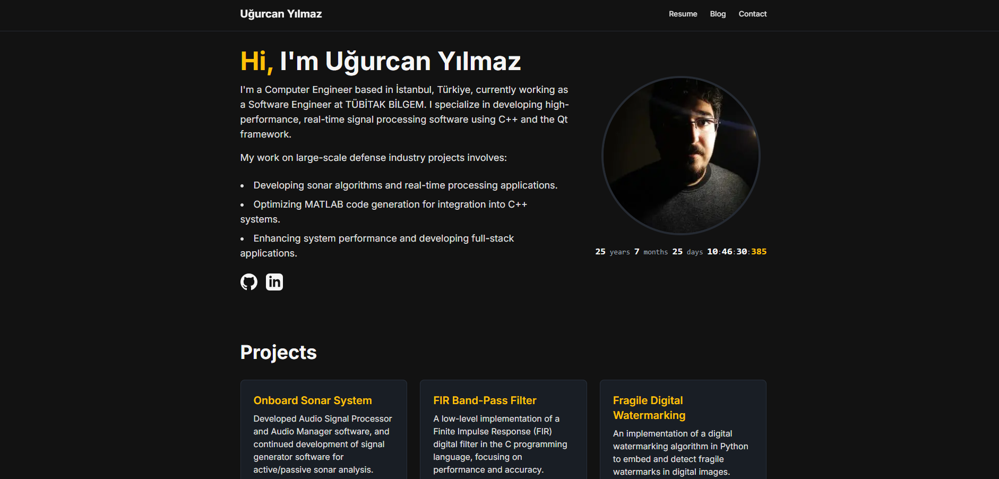

# Personal Resume & Blog Website (Full-Stack Platform)

This repository contains the source code for a comprehensive personal portfolio, resume, and blog website. Built from the ground up, this project serves as a complete showcase of modern full-stack web development, featuring a dynamic frontend, a secure admin panel, and a data-driven architecture.

**Live Site:** [ugurcanyilmaz.com](https://portfolio-devrugus-projects.vercel.app/) <!-- Make sure this is your live domain -->

 <!-- Remember to take a new screenshot! -->

---

## Core Features

This project is a complete content management platform, divided into a public-facing site and a private, feature-rich admin panel.

#### **Public-Facing Site:**
*   **Dynamic & Animated Homepage:** A modern, fully responsive homepage featuring a **live-updating age counter**, a **text scramble effect** for the main heading, and a project showcase populated with data from the resume.
*   **Data-Driven Resume:** A professional resume page that pulls all its data, including a profile image, from a MongoDB database. It also includes a **client-side PDF generation** feature.
*   **Headless Blog:** A fully functional blog that fetches and renders posts from the Sanity.io headless CMS, with dynamically generated pages for each post.
*   **Professional Animations:** The entire site is enhanced with subtle and professional animations using **Framer Motion**, including fade-in on load, staggered list animations for cards, and interactive hover effects.

#### **Private Admin Panel:**
*   **Secure Authentication:** A private `/admin` area protected by a username/password login system using **NextAuth.js**.
*   **Dynamic Resume Editor:** A complete CRUD interface for managing all sections of the resume (personal info, experience, education, skills). All changes are saved directly to the MongoDB database.
*   **Embedded CMS for Blog:** A dashboard that lists all blog posts and provides deep links to create new posts or edit existing ones directly in the **embedded Sanity Studio**.
*   **Live Analytics Dashboard:** Features an **embedded, live analytics dashboard built with Google Looker Studio**, displaying key metrics like visitors by country, page views, and more directly within the admin panel.

---

## Technical Stack

This project utilizes a modern JAMstack architecture, prioritizing performance, security, and developer experience.

*   **Framework:** Next.js (App Router)
*   **Styling:** Tailwind CSS
*   **Animations:** Framer Motion
*   **Backend Logic:** Next.js API Routes (Serverless Functions)
*   **Database:** MongoDB Atlas
*   **Headless CMS (for Blog):** Sanity.io
*   **Authentication:** NextAuth.js
*   **Analytics:** Google Analytics & Google Looker Studio
*   **Date Management:** `date-fns`
*   **PDF Generation:** `jspdf` & `html2canvas`
*   **Dependencies for Sanity:** `styled-components`
*   **Deployment:** Vercel

---

## Running the Project Locally

To run this project on your local machine, follow these steps:

1.  **Clone the repository:**
    ```bash
    git clone https://github.com/devrugu/personal-website.git
    cd personal-website
    ```

2.  **Install dependencies:**
    ```bash
    npm install
    ```

3.  **Set up environment variables:**
    Create a file named `.env.local` in the root of the project and add the necessary secret keys.
    ```env
    # Sanity
    NEXT_PUBLIC_SANITY_PROJECT_ID="YOUR_PROJECT_ID"
    NEXT_PUBLIC_SANITY_DATASET="production"

    # Auth
    AUTH_SECRET="GENERATE_A_SECRET_KEY"
    ADMIN_USERNAME="your_admin_username"
    ADMIN_PASSWORD="your_admin_password"

    # Database
    MONGODB_URI="YOUR_MONGODB_CONNECTION_STRING"

    # Analytics
    NEXT_PUBLIC_GA_MEASUREMENT_ID="YOUR_GA_ID"
    ```

4.  **Run the development server:**
    ```bash
    npm run dev
    ```
    The application will be available at `http://localhost:3000`.